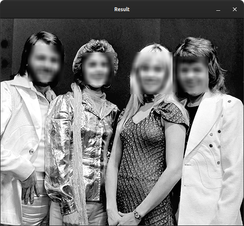
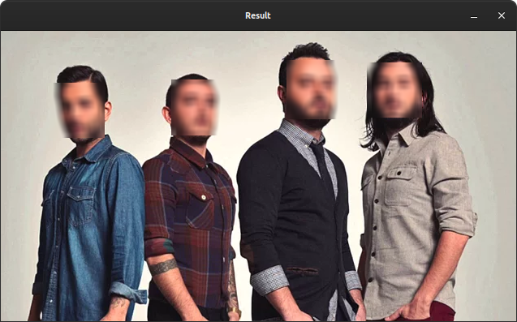

# Face Blurer

## First you need to install requirements

```bash
pip3 install -r requirements.txt
```

## If your packages are satisfied

### How it works for images

Before running, let's check **usage.py** out:

1. Import sys lib for give argument from command line:

```python
import sys
```

2. Import cv2:

```python
import cv2
```

3. Import face_blurer lib to blur the faces:

```python
import face_blurer
```
4. Get given argument:

```python
image_path = sys.argv[1]
```
5. Read image from given path:

```python
image = cv2.imread(image_path)
```

6. Blur the faces in image:

```python
image = face_blurer.blur_face(image)
```
7. Finally write result image to directory and show it on window:

```python
cv2.imwrite("result.jpg", image)

cv2.imshow("Result", image)
cv2.waitKey(0)
```

### Running

***NOTE:*** When running of ***usage.py*** you have to give image as parameter. It shown below.

For Linux:

```bash
python3 usage.py img.png
```

For Windows:

```bash
python usage.py img.png
```

### How it works for live

Before running, let's check **usage_live.py** out:

1. Import libraries as above
2. Realize default steps for real time caturing
3. Blur each frame before showing:

```python
frame = face_blurer.blur_face(frame, 3)
```

4. Get number of faces for each frame:

```python
num_of_faces_frame = face_blurer.num_of_faces(frame)
```

5. Show number of faces for each frame:

```python
frame = cv2.putText(frame, str(num_of_faces_frame), 
                    (50, 50), cv2.FONT_HERSHEY_SIMPLEX, 2, (255, 0, 0), 3)
```

6. At final step, show result frame by frame:

```python
cv2.imshow('frame', frame)
```

### About methods

**blur_face()** method parameters:

```python
blur_face(image_path, level=1)
```
1. first parameter is image
2. level of bluring, default is '1' (0 = low, 1 = mid, 2 = high)

**num_of_faces** method parameters:

This method return number of faces in given image.

```python
num_of_faces(image)
```

* it just get a parameter, image


## Outputs




*TODO:*
<<<<<<< HEAD
- [ ] show gif result of live blurring
=======
- [ ] show gif result of live blurring
>>>>>>> 2ea114457eefc4cffecb4516a0788895bc076407
