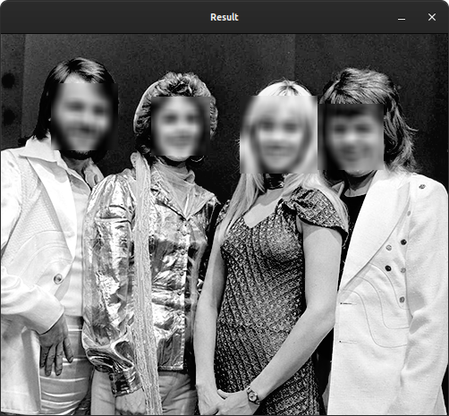

# Face Blurer

## First you need to install requirements

```bash
pip3 install -r requirements.txt
```

## If your packages are satisfied

### How it works

Before running, let's check **usage.py** out:

1. Import sys lib for give argument from command line:

```python
import sys
```

2. Import face_blurer lib to blur the faces:

```python
import face_blurer
```
3. Get given argument:

```python
imagePath = sys.argv[1]
```

4. Blur the faces in image:

```python
face_blurer.blur_face(imagePath)
```

**blur_face()** method parameters:

```python
blur_face(image_path, level=1, show_image=True, save_image=False)
```
1. first parameter is path of image
2. level of bluring, default is '1' (0 = low, 1 = mid, 2 = high)
3. *show_image=True* means, open on new window of result image after processing
4. if you want to save result, give parameter *save_image=True*

**num_of_faces** method parameters:

This method return number of faces in given image.

```python
num_of_faces(image_path)
```

* it just get a parameter, path of image


### Running

***NOTE:*** When running of ***usage.py*** you have to give image as parameter. It shown below.

For Linux:

```bash
python3 usage.py img.png
```

For Windows:

```bash
python usage.py img.png
```

## Outputs



